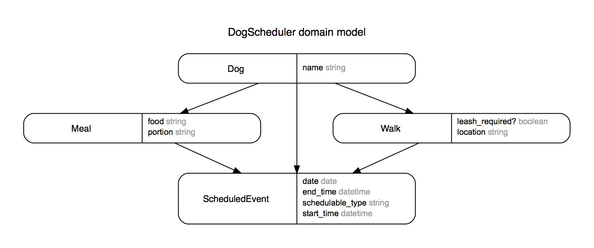

# Dog Scheduler

## Function
- Creates meals/walks for a dog
- Schedules meals/walks for a dog
- Updates scheduled events for a dog
- Deletes scheduled events for a dog
- Retrieves a dog's schedule for a particular day in JSON format

## Database Structure

Polymorphic relationship for Scheduled Events with Meals and Walks
Reasoning:
- The same walks/meals are often repeated on a daily basis. This way, a specific walk/meal is only created once for a dog, but can be scheduled over and over.
- This saves database space because the event specifics (i.e. food, portion, etc) aren't repeatedly added and stored in the scheduled_events table.
- From a ux perspective, users could select a saved meal from a dropdown list and schedule it, rather than continually typing in all the meal specifics.
- It is much easier to scale the number of metrics gathered for meals and walks.
